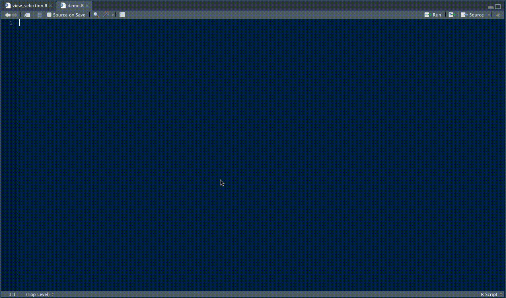

# viewR 

## A pipe-friendly way to invoke the `View()` function

<!-- badges: start -->
[](https://github.com/lukasfeick-sw/viewR/actions/workflows/r-cmd-check.yml)
[](https://github.com/lukasfeick-sw/viewR/actions/workflows/lints.yml)
<!-- badges: end -->

Are you a fan of both `magrittr` pipes *and* the RStudio data viewer? Especially when doing EDA, you'll oftentimes want to casually view the current "state" of your transformed data frame without assigning it to a variable each time. In that case you'd also need to select the variable and press <kbd>F2</kbd>, or <kbd>CMD</kbd> + Click on it in the Source Editor, or click on it the Environment pane -- tedious!

Printing a `data.frame` to the console may be undesirable for formatting reasons and interrupts your workflow because you need to switch panes to scroll through the output.

With `viewR`, you can seamlessly view the currently selected lines of code in the RStudio data viewer: Simply select the lines (just as you always would) and then, instead of executing them, hit the `viewR` shortcut to immediately send the evaluated selection to the RStudio data viewer.

You can even keep the trailing pipe `%>%` and leading or in-line comments `#` selected, making it easy to keyboard-navigate through your code and seamlessly invoke `viewR` on "mid-code" selections -- without any intermediate steps and all while keeping your hands on the keyboard. The title of the new data tab is inferred from the first element in the chain and suffixed with a `_view`.

## Demo



## Installation

Install `viewR` from GitHub with

```r
# install.packages("remotes")
remotes::install_github("lukasfeick-sw/viewR")
```

## Recommended use

`viewR` unfolds its full potential when it's mapped to a sensible keyboard shortcut, for example <kbd>CMD</kbd> + <kbd>Shift</kbd> + <kbd>V</kbd> (as in *V*iew). As for the source code, the necessary infrastructure for this is already in place: In RStudio, navigate to 'Tools' > 'Modify Keyboard Shortcuts' and then search for 'View current selection'. Click on the 'Shortcut' field to assign a new keyboard shortcut.

## Backend

The [backend](https://github.com/lukasfeick-sw/viewR/blob/master/R/view_selection.R) relies heavily on the [`rstudioapi`](https://github.com/rstudio/rstudioapi) package. It captures the currently selected lines, cleans them up, extracts the title to be used for the Viewer tab, adds a `View()` call at the end and then sends the result to the console where it's executed, invoking the data viewer.

## Hex sticker

The hex sticker was created with the [hexSticker](https://github.com/GuangchuangYu/hexSticker) package.
